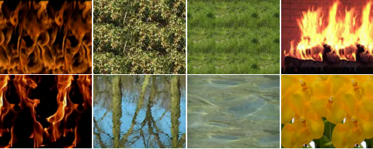

# Dynamic Texture Enlargement

**Grow a short dynamic texture across space and time.**

Research companion to **Michal Haindl and Radek Richtr**, *Dynamic Texture Enlargement*, Spring Conference on Computer Graphics (SCCG), 2013.

[Read the paper](https://library.utia.cas.cz/separaty/2013/RO/haindl-0397609.pdf) · [Publication and DOI](https://doi.org/10.1145/2508244.2508245) · [Companion: Dynamic Texture Editing](https://doi.org/10.1145/2788539.2788559)



*Figure 1 preview from the institutional PDF. Its original image quality is retained; this is not a high-resolution restoration.*

## The idea

Dynamic textures are moving patterns such as vegetation, water, and smoke. A recorded sample has a fixed field of view and duration. This work constructs reusable patches that can be tiled in the two spatial dimensions and in time.

The analysis stage finds overlapping patches and their boundary cuts. Temporal boundaries account for optical flow. The synthesis stage then assembles the prepared tiles; analysis and synthesis are separate.

The paper describes both single-tile and multiple-tile synthesis. Its experimental examples and conclusions remain those of the original publication.

## Archive restoration

This repository is being assembled from the historical research archive. The restoration is limited to recovering the manuscript, original illustrations, and associated media, and documenting typographical corrections. It does not introduce new experiments or change the published method.

| Material | Current availability |
| --- | --- |
| Published article | Public institutional PDF linked above |
| Citation | `CITATION.cff` and `citation.bib` |
| Original LaTeX | `source/original/13sccg_DT.tex` (byte-preserved anonymized review/preprint source) |
| Typo-only source copy | `source/edited/13sccg_DT_typos.tex`, with an explicit `CHANGELOG.md`; original is unchanged |
| Recovered source image | `figures/source/Breh_X0000.png` (720×576 PNG; provenance documented beside it) |
| Higher-resolution figures | One verified source raster recovered; remaining figure assets are still being matched |
| Original videos and data | Recovery and figure-to-video mapping in progress |
| Historical implementation | Not yet recovered; this is not an executable reproduction |

The institutional PDF is the reference for the published content. The recovered
LaTeX is a review/preprint working source with placeholder author metadata, so
it is deliberately kept under `source/original/` and is not presented as the
final proceedings source. A later restored author edition must have a separate
filename and a documented change log.

## Citation

Please cite the original article when discussing or building on the method:

```bibtex
@inproceedings{HaindlRichtr2013DynamicTextureEnlargement,
  author = {Haindl, Michal and Richtr, Radek},
  title = {Dynamic Texture Enlargement},
  booktitle = {Proceedings of the 29th Spring Conference on Computer Graphics},
  year = {2013},
  publisher = {Association for Computing Machinery},
  doi = {10.1145/2508244.2508245},
  url = {https://doi.org/10.1145/2508244.2508245}
}
```

## Rights and provenance

Article rights remain with the respective rights holders. The publisher and institutional copies are linked, not relicensed. Any recovered third-party dataset will retain its own terms and attribution. Repository visibility does not grant a blanket licence to the article or external data.
